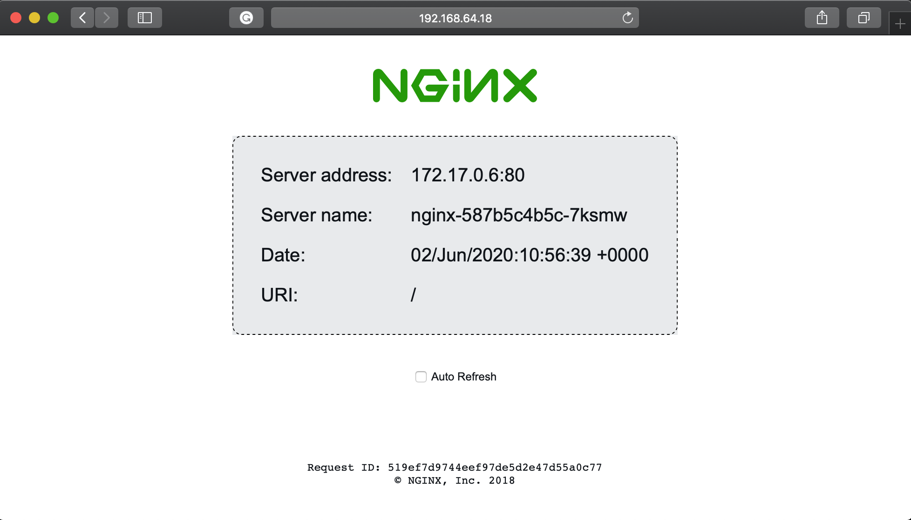

# This Experiment Checks a URL Responds with Success (200) Status when the Webserver a failure condition is injected with Chaos Mesh

This experiment checks a URL responds with a success code when [Chaos Mesh][chaos-mesh] is used to restart the container.

## Setup for Experiment Execution

### Install the Chaos Toolkit

This experiment uses the [free and open source Chaos Toolkit][chaostoolkit]. The instructions for installing the [Chaos Toolkit][chaostoolkit] are available in the [project's documentation][docs].

### Install Chaos Mesh

This experiment is going to use [Chaos Mesh][chaos-mesh] to inject turbulent conditions as part of a [Chaos Toolkit][chaostoolkit] experiment. You will need a Kubernetes cluster to run this, the [Chaos Mesh documentation][chaosMeshMinikube] has instructions for setting getting started with Chaos Mesh with minkube.


[chaostoolkit]: https://chaostoolkit.org/
[docs]: https://docs.chaostoolkit.org
[chaos-mesh]: https://github.com/pingcap/chaos-mesh
[chaosMeshMinikube]: https://github.com/pingcap/chaos-mesh/wiki/Get-started-on-minikube

### Setting up an Application and a Service

In order to have something to measure with the experiment and a container to shutdown when you inject turbulence you will need an application running on you cluster. The following will setup an `nginx` hello world server:

```YAML
apiVersion: apps/v1
kind: Deployment
metadata:
  name: nginx
  labels:
    app: nginx
spec:
  selector:
    matchLabels:
      app: nginx
  replicas: 1
  template:
    metadata:
      labels:
        app: nginx
    spec:
      containers:
      - name: nginx
        image: nginxdemos/hello
        ports:
        - containerPort: 80
```

This can deployed on your cluster with:

```kubectl apply -f nginx.yaml --namespace=chaos-testing```

Then to make the server visible externally run:

```bash
kubectl expose deployment nginx --type="LoadBalancer" -namespace=chaos-testing
```

As you are using ```minikube``` you can  use the ```minikube service``` command to open your default browser to the external end point on minikube.

```bash
  minikube service nginx --namespace=chaos-testing
```

You should see this in your browser:



You can make a note of the URL for use when running the exeriment for later.

## Monitoring

To give you some visibility of whats going on on minikube you can run the following commands:

```bash
watch -n 1  curl -s -I  http://192.168.64.18:32571/
 ```

 The IP address above will need to be changed according to your own IP address. This will give you a summary response from your server  on minikube including the status code. If the server fails the output will stop.

 Using Chaos Mesh means there are a number of pods running on minikube so it would be good to monitor the activity as well. You can either use [k9s](ttps://github.com/derailed/k9s/blob/master/README.md) or from the command line you can use:


 ```bash
 watch -n 1  kubectl get pods --all-namespaces
 ```

## Running the Experiment

The experiment in this case will depend on the `kubectl` command so you will need `kubectl` in your path and it needs to be connected to your cluster. If you followed the steps on Chaos Mesh you should be good to go.

### Required Parameters

This experiment requires the following parameters:

#### Environment Variables
  * `ENDPOINT_URL` - Specifies the end point URL that is checked by the experiment.
  * `CHAOS_YAML` - Specifies the name of the YAML file that contains your litmus chaos engine experiment

  There are a couple of examples of Chaos Mesh YAML files included in this repo:
  * [nginx-pod-failure](nginx-pod-failure.yaml) - this causes a failure on the POD which causes a longer outage on the webserver.
  * [nginx-pod-kill](nginx-pod-kill.yaml) - this  kills a Pod, which will automatically restart and has less impact than the pod failure example above.

  There are many more examples of failure conditions that can be induced by Chaos Mesh in the [Chaos Mesh repo](https://github.com/pingcap/chaos-mesh/tree/master/examples)


### Running the Experiment from a Local Copy

You can run this experiment using the native `chaos` command.

Note in this case we have a method in the [experiment.json](experiment.json) that is going to use a python process to run the ```kubctl apply -f```, this will cause Chaos Mesh to inject turbulence on the server.

Run. the experiment with the native `chaos` command:

```bash
(chaostk) ENDPOINT_URL=http://192.168.64.18:32571/  \
          CHAOS_YAML=nginx-pod-failure.yaml \
          chaos  run experiment.json
```

### Running the Experiment Direct from the Catalog using HTTP

You can run this experiment using the native `chaos` command, or using


```bash
(chaostk) export ENDPOINT_URL=https://httpstat.us/200?sleep=2000; \
          chaos run https://raw.githubusercontent.com/open-chaos/experiment-catalog/master/local/choas-mesh-turbulence/experiment.json
```


